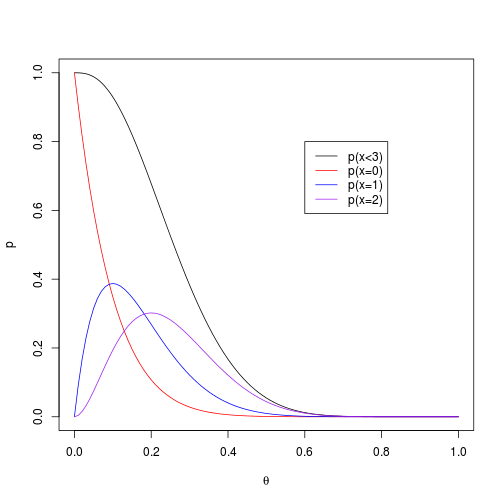
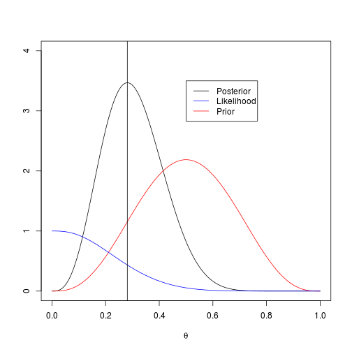

# Exercise 2.11
To quote Problem 2.11 from Gelman et al (2004)
> Posterior inference: suppose there is Beta(4,4) prior distribution on the probability $\theta$ that a coin will yield a 'head' when spun in a specified manner. The coin is independently spun ten times, and 'heads' appear fewer than 3 times. You are not told how many heads were seen, only that the number is less than 3. Calculate your exact posterior density ( up to a proportionality consant) for $\theta$ and sketch it.


```r
library(xtable)
```


## Explore Beta distribution
First let's examine the specific Beta distribution used in the exercise $\text{Beta}(4,4)$.


```r
curve(dbeta(x, 4, 4), from = 0, to = 1)
```

 


* The distribution appears unimodal, continuous on the interval $[0, 1]$ and symmetric. 
* From the plot, the mode and mean appear to be 0.50. This is consistent with the formula for the mean, $E[X] = \frac{\alpha}{\alpha + \beta} = \frac{4}{4+4} = 0.5$, and the formula for the mode, $\frac{\alpha - 1}{\alpha + \beta -2} = \frac{4 -1}{4 + 4 -2} = \frac{3}{6} = 0.5$.


Now let's write a function to represent the beta distribution from scratch:


```r
beta_distribution <- function(x, Alpha, Beta) {
    gamma(Alpha + Beta)/(gamma(Alpha) * gamma(Beta)) * x^(Alpha - 1) * (1 - 
        x)^(Beta - 1)
}

x <- seq(0, 1, 0.1)
p_x <- beta_distribution(x, 4, 4)

cbind(x, p_x, dbeta = dbeta(x, 4, 4))
```

```
##         x    p_x  dbeta
##  [1,] 0.0 0.0000 0.0000
##  [2,] 0.1 0.1021 0.1021
##  [3,] 0.2 0.5734 0.5734
##  [4,] 0.3 1.2965 1.2965
##  [5,] 0.4 1.9354 1.9354
##  [6,] 0.5 2.1875 2.1875
##  [7,] 0.6 1.9354 1.9354
##  [8,] 0.7 1.2965 1.2965
##  [9,] 0.8 0.5734 0.5734
## [10,] 0.9 0.1021 0.1021
## [11,] 1.0 0.0000 0.0000
```


We can confirm that it is a probability distribution by showing that it numerically integrates to one.


```r
step_size <- 0.001
x <- seq(0, 1, step_size)
dbeta_x <- dbeta(x, 4, 4)
dbeta_x_step_size <- dbeta_x * step_size
sum(dbeta_x_step_size)
```

```
## [1] 1
```

```r

plot(dbeta_x ~ x, pch = ".")
lines(x, x)
lines(x, cumsum(dbeta_x_step_size))
```

 


* This code shows how with a `step_size` of .001, the are numerically integrates to 1.
* The figure shows the density, cumulative distribution, and x.

## Explore Binomial likelihood
The problem states that after ten spins, there have been 0, 1, or 2 heads. We can assume that the observations are independent and identically distributed.

First, let us write an equation to produce the probability mass of a given set of parameters.


```r
probability_binomial <- function(x, n, p) {
    choose(n = n, k = x) * p^x * (1 - p)^(n - x)
}

x <- 0:10
p_x <- probability_binomial(x, 10, 0.5)
```


```r
Table <- cbind(x, p_x, dbinom = dbinom(x, 10, 0.5))
print(xtable(Table), type = "html", include.rownames = FALSE)
```

<!-- html table generated in R 2.15.1 by xtable 1.7-0 package -->
<!-- Wed Jul 18 16:11:02 2012 -->
<TABLE border=1>
<TR> <TH> x </TH> <TH> p_x </TH> <TH> dbinom </TH>  </TR>
  <TR> <TD align="right"> 0.00 </TD> <TD align="right"> 0.00 </TD> <TD align="right"> 0.00 </TD> </TR>
  <TR> <TD align="right"> 1.00 </TD> <TD align="right"> 0.01 </TD> <TD align="right"> 0.01 </TD> </TR>
  <TR> <TD align="right"> 2.00 </TD> <TD align="right"> 0.04 </TD> <TD align="right"> 0.04 </TD> </TR>
  <TR> <TD align="right"> 3.00 </TD> <TD align="right"> 0.12 </TD> <TD align="right"> 0.12 </TD> </TR>
  <TR> <TD align="right"> 4.00 </TD> <TD align="right"> 0.21 </TD> <TD align="right"> 0.21 </TD> </TR>
  <TR> <TD align="right"> 5.00 </TD> <TD align="right"> 0.25 </TD> <TD align="right"> 0.25 </TD> </TR>
  <TR> <TD align="right"> 6.00 </TD> <TD align="right"> 0.21 </TD> <TD align="right"> 0.21 </TD> </TR>
  <TR> <TD align="right"> 7.00 </TD> <TD align="right"> 0.12 </TD> <TD align="right"> 0.12 </TD> </TR>
  <TR> <TD align="right"> 8.00 </TD> <TD align="right"> 0.04 </TD> <TD align="right"> 0.04 </TD> </TR>
  <TR> <TD align="right"> 9.00 </TD> <TD align="right"> 0.01 </TD> <TD align="right"> 0.01 </TD> </TR>
  <TR> <TD align="right"> 10.00 </TD> <TD align="right"> 0.00 </TD> <TD align="right"> 0.00 </TD> </TR>
   </TABLE>


```r
plot(x, p_x, ylab = expression(p(theta)))
```

 


Now let us examine the probability of at least 2 heads from 10 spins for varying values of $\theta$.


```r
x <- seq(0, 1, 0.01)
p_x <- pbinom(2, 10, x)

plot(x, p_x, type = "l", xlab = expression(theta), ylab = "p")
lines(x, dbinom(0, 10, x), col = "red")
lines(x, dbinom(1, 10, x), col = "blue")
lines(x, dbinom(2, 10, x), col = "purple")
legend(0.6, 0.8, c("p(x<3)", "p(x=0)", "p(x=1)", "p(x=2)"), lty = 1, 
    col = c("black", "red", "blue", "purple"))
```

 


* The probability of getting 0, 1, or 2 heads is the sum of the individual probabilities.
* The plot shows the individual probabilities and the overall probabilities across the full range of possible values of $\theta$.
* The mode of $p(x=k)$ is $k/n=\theta$. For example, when $\theta=0$, $p(x=0) = 1$.

# Calculate posterior numerically
The following plots the prior, likelihood, and posterior based on a grid of values of $\theta$.


```r
Theta <- seq(0, 1, 0.001)

Likelihood <- pbinom(2, 10, Theta)
Prior <- dbeta(Theta, 4, 4)
Numeric_Posterior <- Likelihood * Prior/sum(Likelihood * Prior)/0.001

plot(Theta, Numeric_Posterior, type = "l", ylim = c(0, 4), xlab = expression(theta), 
    ylab = "")
lines(Theta, Prior, col = "red")
lines(Theta, Likelihood, col = "blue")
legend(0.5, 3.5, c("Posterior", "Likelihood", "Prior"), lty = 1, 
    col = c("black", "blue", "red"))

abline(v = Theta[which.max(Numeric_Posterior)])
```

 


* The vertical line shows the numerically estimated posterior mode (i.e., `0.281`). Naturally, the posterior mode (and mean) is between the mode (and mean) of the prior and the likelihood.

Thus, we can write the following:

$$\begin{align}
p(\theta|y \in \{0,1,2\}) & \propto p(y \in \{0,1,2\}|\theta) p(\theta)\\
  & \propto \sum_{i=0}^2 \binom{10}{i} \theta^i (1-\theta)^{10-i} \times 
   \theta^{4-1}(1-\theta)^{4-1} \\
  & = \sum_{i=0}^2 \binom{10}{i} \theta^{i + 3} (1-\theta)^{13-i} \\
\end{align}$$

* The likelihood is the binomial distribution summed over the possible values of $y$. 
* The prior is the beta distribution. The $\frac{\Gamma(4+4)}{\Gamma(4)\Gamma(4)}$ was removed from the beta distribution because it does not vary with $\theta$.
* The equation was simplified by grouping terms.

We can use this equation in R to plot the posterior.


```r
posterior_direct <- function(Theta) {
    sum(sapply(0:2, function(i) choose(10, i) * Theta^(i + 3) * (1 - Theta)^(13 - 
        i)))
}

Theta <- seq(0, 1, 0.001)
Equation_Posterior <- sapply(Theta, function(X) posterior_direct(X))
plot(Theta, Equation_Posterior, type = "l")
```

 


The following confirms that the numeric and equation estimates of the posterior agree up to a proporitionality constant.


```r
plot(Numeric_Posterior, Equation_Posterior, pch = ".")
```

 

```r
cor(Numeric_Posterior, Equation_Posterior)
```

```
## [1] 1
```


